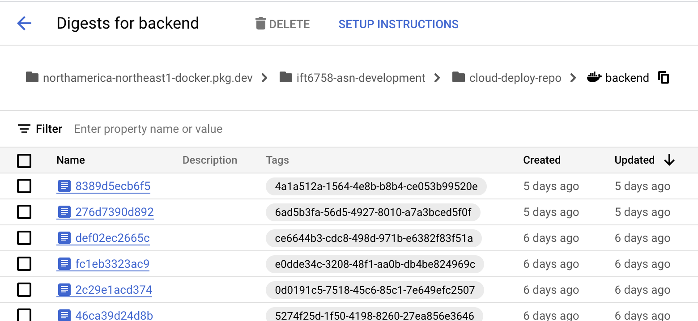

# Homework $5$ 

Assignment scoring:

| Section                       | Score |
|-------------------------------|:-----:|
| Question 1                    |  46   |
| Question 2                    |  12   |
| Question 3                    |  12   |
| Question 4                    |   3   |
| Question 5                    |   2   |
| Question 6                    |  12   |
| Question 7                    |   8   |
| Question 8                    |   5   |

<!-- This should total to 100 -->

In general your homework will be autograded, i.e. you must **not** modify the signature of the defined 
functions (same inputs and outputs).

## Background

The goal of this assignment is to get experience working with a cloud provider (in this case, Google Cloud) in order to build and deploy machine learning applications.

Specifically, we will be working with [Google Cloud Build](https://cloud.google.com/build) to build our application as a set of Docker Images and store them in a remote repository (called the [Google Artifact Registry](https://cloud.google.com/artifact-registry)).

Our application consists of a backend (Flask App) and frontend (Streamlit App) component that will be built into separate Docker images. The frontend will allow us to submit a URL of an image, which will be sent to the backend for classification by an ML model.

We will then use [Google Cloud Run](https://cloud.google.com/run) in order to deploy each component of the application to the web.


It will be your job to write the code and configuration files required to:
- Submit builds to Google Cloud Build
- Deploy each component to Google Cloud Run

There will also be short-answer questions. Write and submit your answers in `SHORT_ANSWER_TEMPLATE.md`

### 0. Sign Up for an account on Google Cloud
If you do not already have an account on Google Cloud, you can create one [here](https://console.cloud.google.com).

The following videos provide a walkthrough of some key concepts when working with Google Cloud:
- How to sign up for Google Cloud --  [link](https://youtu.be/ogzJovMsDIU?si=VCZ16ONz0CYvbGBV&t=40)
- How to navigate Google Cloud -- [link](https://youtu.be/27Pb5g7bEAA?si=yuuDIv_4nzJL2tLd&t=75)

### 1. Install the gcloud CLI
The Google Cloud CLI (gcloud) is a "set of tools to create and manage Google Cloud resources," ([source](https://cloud.google.com/sdk/gcloud)). Using gcloud is required to interact with Google Cloud from your machine.

Instructions to install gcloud can be found [here](https://cloud.google.com/sdk/docs/install).

Once you install gcloud, use it to set your project:
```
gcloud config set project MY_PROJECT_NAME
```

You can verify that you're running in the correct project by running:
```
gcloud config list
```


# Questions

## 1. Question 1
The first step will be to create a cloudbuild YAML file, which determines the steps required to build our Docker image and push it to Artifact Registry.

### Creating a Cloud Build YAML

Follow the instructions in `deployment/cloudbuild_template.yaml` to create a cloudbuild YAML file that will build and push our Docker image. Create four cloudbuild YAML files (one for each component: backend_v1, backend_v2, frontend_v1, frontend_v2).

In the CloudBuild file we build two images:
- A "base" image that contains all our dependencies.
- A second image which is built from our base image that installs our code.
We will explore why in the next question.

Note the following:
- `REGISTRY` should be `northamerica-northeast1-docker.pkg.dev`
- `MY_PROJECT` should be the name of your Google Cloud project.
- `MY_IMAGE_NAME` should be backend_v1, backend_v2, frontend_v1 or frontend_v2.
- `TAG` should be either `${BUILD_ID}` or latest.

`${BUILD_ID}` is an environment variable present in Google Cloud Build which holds the value of the current unique build identifier.

More information on building a Cloud Build YAML file can be found [here](https://cloud.google.com/build/docs/configuring-builds/create-basic-configuration).

### Submitting the build to Cloud Build

Once you have created the Cloud Build file, use the `gcloud` command to submit the build to Cloud Build. You can use the `submit_build_template.sh` file to accomplish this. More documentation on `gcloud builds` can be found [here](https://cloud.google.com/sdk/gcloud/reference/builds/submit).

When you run the script, you will see the logs output to the terminal. `gcloud` will also give you a link to view the build in your web browser. You can view all your builds [here](https://console.cloud.google.com/cloud-build/builds).

### Deliverables

For this question you should submit the following files:
- 4 Cloudbuild YAML files (name each file cloudbuild_{component}.yaml)
- 4 submit build scripts (name each file submit_build_{component}.sh)

where {component} is one of the four components listed above.

## 2. Question 2
How many images are built every time you submit a build?
Does this need to be the case? Why or Why not?
If not, how could you speed up the build process?
Add a step at the beginning of your cloud build files to solve this inefficiency (Hint: it will involve pulling a certain image before running the other steps).


## 3. Question 3
Once we have built and pushed our Docker images, we can deploy them using the Google Cloud Run service.
This question will focus on deploying `backend_v1` and `frontend_v1` services. All your Google Cloud Run services can be found [here](https://console.cloud.google.com/run).

You can use the `deploy_service_template.sh` to get started.

When deploying your front end service, make sure that you specify an environment variable, `SERVING_URL`, which is the URL of the backend service.

You will also need to know the URI of the image you want to deploy. You can find these in the Artifact Registry, located [here](https://console.cloud.google.com/artifacts). It should look something like below:



Clicking on the three dots beside the desired image, and selecting "Show pull command", you can get the full URI of the image.

Include two scripts in your submission:
- `deploy_backend_v1.sh`
- `deploy_frontend_v1.sh`
- Fill out the appropriate entry in `deliverables.yaml`

## 4. Question 4
When `backend_v1` is deployed, you'll notice in the logs that it is downloading the ResNet model from the PyTorch Hub. This will take some time.

What are some ways that we can circumvent this?
Will it effect the build process? If so, how?

## 5. Question 5
We have deployed the backend and frontend services separately.
What are some pros and cons to this approach?

## 6. Question 6
Deploy `backend_v2` and `frontend_v2` services by creating two new cloud run services: `backend_v2` and `frontend_v2`.

When deploying your front end service, make sure that you specify an environment variable, `SERVING_URL`, which is the URL of the backend service.

You can use the `deploy_service_template.sh` to get started.
Include two scripts in your submission:
- `deploy_backend_v2.sh`
- `deploy_frontend_v2.sh`
- Fill out the appropriate entry in `deliverables.yaml`

In this application, we will be able to select from different models to use for classification.

## 7. Question 7
If you look at `backend_v1/app.py` and `backend_v2/app.py` you will see that the model(s) are loaded into a global variable called `model`.

In the case of our `v1` application, why is this not really an issue?
In `v2`, why is this a problem (Hint: what if two people were using the UI at the same time)?

What would we have to modify to fix this.
- In the front end? (Hint: Read [this](https://testdriven.io/blog/flask-sessions/) article)
- In the back end?
    - Hint: What are the implications of loading the chosen model on each request? Are multiple models in the same container even a good idea? Why or Why not?


## 8. Question 8
Inspect the code in `v3/`. You don't need to build and deploy it (in fact, parts of it are incomplete). What is it trying to accomplish? How is it different from previous versions? (Hint: What is an API gateway?)

# References
TODO